# The BigSMILES Line Notation

> The BigSMILES string for ethylene and methyl methacrylate copolymer:
>
> 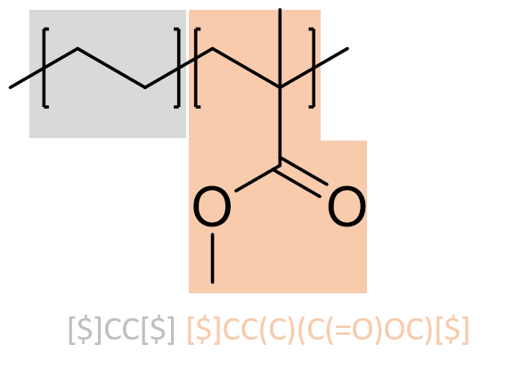

BigSMILES is a structurally based line notation based on the highly successful SMILES (simplified molecular-input line-entry system) representation.  It provides extensions over regular SMILES, which can only represent molecules with given deterministic molecular structures, and support the representation of molecules that are characterized by a distribution of distinct molecular structures instead of a single well-defined structure. This feature is designed specifically to reflect the stochastic nature of polymer molecules. Since polymers are macromolecules that usually have large molecular weights, the line notation is termed BigSMILES.


<aside class="notice">
Please note that the BigSMILES line notation continually revised to provide additional features and important bug fixes. This page hosts the latest version of BigSMILES, which may differ from the syntax discussed in the <a href="https://pubs.acs.org/doi/10.1021/acscentsci.9b00476">original paper</a>. <br/>
The current version is v1.1. Please check the <a href="#version-history">version history</a> for the detailed log of changes.
</aside>


This article is meant as an documentation for the BigSMILES syntax. The reader is assumed to be familiar with the SMILES syntax. If you are not familiar with the syntax of SMILES, this Daylight CIS [page](https://daylight.com/dayhtml/doc/theory/theory.smiles.html) provides a great introduction to the subject.


For additional examples, this [page](BigSMILES_examples.md#Examples-of-BigSMILES-Encoding) provides examples of how BigSMILES can be used to encode common commodity polymers and polymers selected from literature with complex structures.


# Syntax

The syntax of BigSMILES is identical to SMILES except for the introduction of the following new objects:

1. the stochastic object, and
2. the bonding descriptors

The ***stochastic object*** is the principle extension that enables the enumeration of stochastic molecular structures. A stochastic object represents a family of polymeric fragments. It could be used as if it was a normal atom and be embedded within SMILES strings as a proxy atom that symbolizes the ensemble of polymeric fragments that it implicitly represents. 

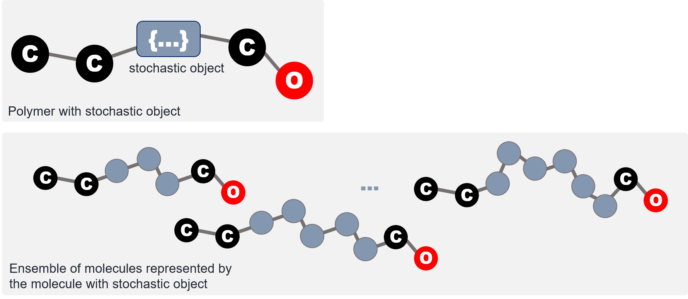

The family of structures a stochastic object represent is defined by the building blocks, or repeat units, of the polymeric segment. Within a stochastic object, one or more repeat units are tabulated, and the pattern by which the repeat units can interconnect with each other are specified. In BigSMILES, such connectivity patterns are denoted by attaching ***bonding descriptors*** to atoms to indicate where and how a pair of atoms on two repeat units can be joined into a larger molecular fragment. The syntax for the bonding descriptors and stochastic objects will be introduced in subsequent sections.

## Bonding Descriptors

To specify where and how repeat units can be joined with another repeat unit, the bonding descriptors are introduced. Bonding descriptors are placed on atoms of a repeat unit that could form direct bonds with another repeat unit.


For instance, as illustrated by the figure, on a methyl methacrylate repeat unit, the two backbone carbon atoms that connect with other repeat units each has a bonding descriptor attached to it; similarly, for a glycine repeat unit, the nitrogen and carbon atoms on the two termini also have bonding descriptors directly attached, indicating that they are terminal atoms that connect to other repeat units.

In BigSMILES, there are two types of bonding descriptors:

1. The "`$`" descriptor, or AA-type descriptor    
   This descriptor describes the connective pattern in which any atom with a "`$`" descriptor can connect with any other atom with the same bonding descriptor. 
2. The "`<`" and "`>`" descriptors, or AB-type descriptor  
   This pair of descriptors describes the connective pattern in which the atoms with the "`<`" descriptor could only connect with another atom with the conjugate "`>`" descriptor. 

### AA-Type Descriptor

> The bonding descriptors can be written as if they are atoms. For example, the ethylene repeat unit for the poly(ethylene-butene) example reads

```plaintext
[$]-CC-[$] or [$]CC[$] 
```

> For the butene repeat unit, its BigSMILES read

```plaintext
[$]CC(CC)[$]
```

> In general, the repeat unit can be rewritten without the bonding descriptors being at the ends of the string. For instance, the following BigSMILES string

```plaintext
C([$])C([$])CC
```

> represents the exact same butene repeat unit.

The AA-type of descriptor is useful for describing the connectivity pattern for vinyl polymers, in which the backbone carbon atoms can connect any other vinyl carbon (although some configurations are unlikely). 

For instance, the use of the AA-type descriptor can be illustrated by the example of poly(ethylene-butene). As illustrated in the figure, the polymer is represented by two repeat units, the ethylene and butene units. Since any pair of atoms with a `$` descriptor could be joined to form a dimer, for this polymer, there are 6 possible distinct dimers that could be constructed from the repeat units, as tabulated on the right panel. These dimers can be further joined with other repeat units or higher order oligomers to generate other polymeric fragments.

### AB-Type Descriptor

> AB-type descriptor has syntax similar to the AA-type descriptor. For example, the repeat units for the first nylon-6,6 are

```plaintext
[<]C(=O)CCCCC(=O)[<] and [>]NCCCCCCN[>]
```

> whereas the second nylon example reads

```plaintext
[<]C(=O)CCCCC(=O)NCCCCCCN[>]
```

> Another instance where the AB-type bonding descriptors become useful is polymers synthesized through ring-opening polymerization. For example, poly(ethylene glycol) repeat unit would read

```plaintext
[<]CCO[>] or [>]CCO[<]
```

> 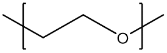


The AB-type descriptors are useful in describing polymers formed via polycondensation. 


For instance, nylon-6,6 formed from condensation between amine and carboxylic groups are best described by the `<` and `>` descriptors, which ensure that the nitrogen atoms always connect with the carbon atoms, in accordance with the chemistry.

<aside class="notice">
It should be noted that the connectivity pattern specified by bonding descriptors include all "possible" realizations. The descriptors do not indicate whether such connection is likely or not. As detailed in the next section, the descriptors, together with the stochastic object, describes an "unweighted" ensemble of all possible molecular fragments.
</aside>

### Syntax for Bonding Descriptors

> Bonding descriptors can be embedded within BigSMILES strings just like atoms. For instance, a (hypothetical) ethylene unit with two orthogonal bonding descriptors reads

```plaintext
[$1]-CC-[$2] or [$1]CC[$2] or C([$1])C[$2]
```

> A repeat unit can have more than two atoms that are connected to a bonding descriptor. For instance, consider branched poly(ethylene). A branched PE would be consisted of repeat units with 2 bonding descriptors (linear), 3 bonding descriptor (branching site) or even more descriptors.

```plaintext
[$]-CC-[$] (linear unit),  [$]-CC([$])-[$] (branched unit)
```

> In the previous examples, the SMILES bonds leading up to the bonding descriptors were all single bonds. This implies that when two repeat units are joined into a dimer, the bond between the pair of atoms would be a single bond as well. 
>
> To represent polymers with double bond across repeat units, a similar syntax is used

```plaintext
[$]=CCC=[$]
```

> 

Formally speaking, within BigSMILES strings, the bonding descriptor are denoted with the following syntax:

`bonding_descriptor = '[' + descriptor_type + descriptor_id + ']'`

A bonding descriptor is composed of three components:

1. A bonding descriptor is enclosed by a pair of square brackets.
2. The `descriptor_type`, immediately following the opening bracket. 
   * The `descriptor_type` can be one of the three symbols: "`$`", "`<`" or "`>`"
3. The `descriptor_id` of the descriptor, denoted by a number

The `descriptor_id` is an additional label for specifying multiple sets of chemically orthogonal bonding descriptors. Descriptors only recognize other descriptors with identical id; atoms connected to descriptors with different labels cannot be joined. If there is only a single type of descriptor, the descriptor id may be omitted.

<aside class="notice">
The id for $ and &gt;,&lt; are implicitly considered orthogonal; i.e., $1 do not connect with either &lt;1 or &gt;1. However, while it is permissible to reuse the same id/label between the two types of descriptors, it is recommended that distinct label be used for each distinct descriptor to prevent potential confusion.
</aside>

Within a BigSMILES string, the bonding descriptors share the same syntax as normal SMILES atoms. The SMILES bond symbol between an atom and its associated bonding descriptor is interpreted as the type of bond that will be created when two atoms are joined together to form a larger fragment. Therefore, the bond order for the bond leading up to the bonding descriptor must be consistent throughout all occurrences in every repeat unit.

<aside class="warning">
The bonding descriptor syntax has been updated and is different from the <a href="https://pubs.acs.org/doi/10.1021/acscentsci.9b00476">version 1.0 presented in ACS Central Science</a>.
</aside>

## Stochastic Object

SMILES provides a linearization scheme for chemical graphs. However, in general, chemical graphs with deterministic structures are not the best model for describing polymers, which are intrinsically random molecules that represent an ensemble of different chemical connectivity. To embrace such stochastic nature, BigSMILES introduces the notion of ***stochastic objects***. Stochastic objects are the key component that provides support for stochastic structures. They are entities that represent random chemical structures that corresponds to polymeric segments within molecules. Syntax-wise, a stochastic object's behavior is identical to that of SMILES atoms. Therefore, stochastic objects can be embedded within a regular SMILES string as if they are normal atoms. 

<aside class="notice">
For the current version, stochastic objects are allowed maximal valency of two. 
</aside>

### Syntax for Stochastic Objects

> For the poly(ethylene-butene) example illustrated in earlier section, the stochastic object that represents the uncapped polymeric fragments that are composed of the two repeat units read

```plaintext
{[][$]CC[$],[$]CC(CC)[$][]}
```

> The "empty" terminal bonding descriptors indicate that the stochastic object does not have any connection to explicit end groups. 
>
> Similarly, nylon-6,6 can be represented as

```plaintext
{[][<]C(=O)CCCCC(=O)[<],[>]NCCCCCCN[>][]}
```

> for the polymer synthesized from adipic acid and hexamethylenediamine. 
>
> For nylon synthesized from amino acid, the BigSMILES reads

```plaintext
{[][<]C(=O)CCCCC(=O)NCCCCCCN[>][]}
```

A stochastic object acts as an proxy within a SMILES string and represents a polymeric segment with stochastic structure. The exact ensemble of structures that a stochastic object represent is defined by is constituent **repeat units** and **end groups**. The syntax for stochastic is given by 

`stochastic_object = '{' + '[' + terminal_bonding_descriptor + ']' + repeat_unit_1 + ',' + repeat_unit_2 + ',' + ... + ',' + repeat_unit_n + ';' + end_group_1 + ',' + end_group_2 + ',' + ... + ',' + end_group_m + '[' + terminal_bonding_descriptor + ']' + '}'`

Each stochastic object contains the following sections:

1. A pair of curly brackets "`{`" and "`}`" that encloses the inner components. The entire object wrapped within the brackets `{...}` are syntactically treated as if it is a normal atom.
2. A comma-delimited list of `repeat_unit`s. 
   * This list contains the set of building blocks that could be used to construct oligomeric and polymeric fragments. 
   * Each `repeat_unit` within the list is represented by a BigSMILES string that contains two or more bonding descriptors. 
   * The stochastic object represents the entire ensemble of polymeric fragments that could be generated by interconnecting the repeat units into larger fragments. Note that each repeat unit within the list can be used zero, one or multiple times.
   * All possible ways of interconnecting a pair of repeat units, by means of joining two smaller molecular graphs into a larger molecular graph, that are permissible by the prescribed bonding descriptors are allowed. 
     As illustrated by the example on the example panel, repeat units need not connect in the orientation depicted in the repeat units. Repeat units can be flipped or reoriented 
3. A comma-delimited list of `end group`s. The end group list is separated from the repeat unit list by a semicolon. 
   * Each end group within the list should contain exactly one bonding descriptor.
   * If no end group is to be specified, the leading semicolon can be omitted.
4. Two `terminal_bonding_descriptors` placed immediately within the curly brackets.   
   * The terminal bonding descriptor indicate how the internal stochastic structure is connected to the exterior of the stochastic object (to the regular SMILES strings immediately leading and trailing the stochastic object).   
   * Whenever an end of the stochastic object is capped with external SMILES string, the terminal bonding descriptor must be specified.  
   * Moreover, even in the case where the end of the stochastic object is not capped by an external SMILES fragment, the "empty" bonding descriptor "`[]`" should still be explicitly included to indicate the absence of such connection.

<aside class="warning">
The terminal bonding descriptor syntax has been updated and is different from the <a href="https://pubs.acs.org/doi/10.1021/acscentsci.9b00476">version 1.0 presented in ACS Central Science</a>.
</aside>

### End Groups

> Consider the ethylene butene copolymer example. For a BigSMILES string that reads

```plaintext
{[][$]CC[$],[$]CC(CC)[$][]}
```

> the "empty" terminal bonding descriptors indicate that the stochastic object does not have any connection to explicit end groups. In this case, since no implicit end groups were assigned, the BigSMILES string represents a uncapped fragment.
>
> Now, consider the case

```plaintext
C{[$][$]CC[$],[$]CC(CC)[$][$]}
```

> The left end in this case has explicit end group of one carbon. Moreover, since the right terminal descriptor is non-empty, it indicates that the other end of the stochastic object is also connected to some exterior SMILES string. For this case, the "invisibility" of the SMILES string suggests that it is connected to a hydrogen atom, which is omitted by default in SMILES syntax.
>
> To further illustrate the syntax for end groups, consider again the nylon-6,6 example. The end groups for the linear polymer can be expressed with the explicit syntax

```plaintext
[H]O{[>][<]C(=O)CCCCC(=O)[<],[>]NCCCCCCN[>][<]}[H]
```

> or with the implicit syntax

```plaintext
{[][<]C(=O)CCCCC(=O)[<],[>]NCCCCCCN[>];[>]O[H],[<][H][]}
```

> Note that the terminal bonding descriptors should still be included even if they are empty
>
> The same polymer can also be expressed with the mixed explicit and implicit representation:

```plaintext
[H]O{[>][<]C(=O)CCCCC(=O)[<],[>]NCCCCCCN[>];[<][H][]}
```

> To illustrate the use of end groups in branched polymers, consider the following hyperbranched polymer 
>
> 
>
> The polymer has exactly one end with boron end group, and all the other ends are capped by bromide. This end group pattern can be expressed by the implicit style or the mixed style

```plaintext
{[][<]c1cc([>])cc([>]c1);[<]Br,[>]B(O)O[]} (implicit)
OB(O){[>][<]c1cc([>])cc([>]c1);[<]Br[]} (mixed)
```

> Note that the bromide end group cannot be specified explicitly because the number of bromide ends are not a fixed number but rather depends on the exact enumeration of the polymeric structure.


As implied in the syntax, there are two equally valid options for reporting the end groups for a polymeric segment represented by a stochastic object:

1. Explicit SMILES strings leading or trailing a stochastic object. 
2. End groups specified within the list of end groups within the stochastic object.

**Explicit End Groups**

In the first case, the BigSMILES string is interpreted as the following figure,

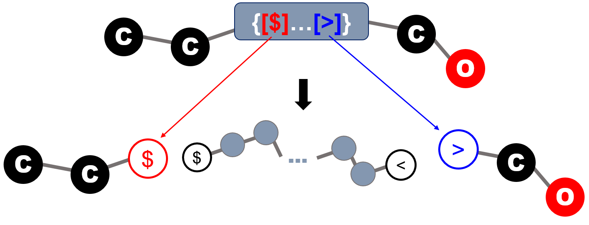

in which the terminal bonding descriptors are effectively attached to the atoms on the exterior SMILES string to serve as end groups. Each end group in this case corresponds to exactly one copy that caps one   open end of the polymeric fragment.

Similar to the case for bonding descriptors found within repeat units, the SMILES bond symbol leading and trailing the stochastic objects are interpreted as the type of bond that should be formed when the atom on the explicit end group is joined with an atom on a repeat unit. Therefore, the leading and trailing bonds must be consistent with the bonding descriptors defined on the repeat units within the stochastic object.

**Implicit End Group within Stochastic Object**

In the second case, the end groups in the list are allowed to cap the open ends (atoms with unclosed bonding descriptors). If multiple end groups with identical bonding descriptors are present, the stochastic object implicitly include all possible molecular graphs. Note that all ends on the molecular fragment constructed by joining repeating units will be considered capped when end groups are specified. Only the ends without suitable end groups will be considered uncapped. 


Note that unlike the explicit case, there may be multiple copy of each end group used in capping the polymeric fragment. This notation is especially useful in denoting the end groups of randomly branching polymers, in which the number of end groups required is not a fixed number, and therefore cannot be a priori specified.

**Mixed Explicit and Implicit End Groups**

In the case where a stochastic object with non-empty end group list also has explicit terminal end groups, the explicit end groups take precedence. That is, the explicit end groups will always be considered first to cap the open ends; after all explicit ends have been utilized, the remaining open ends are capped with the end groups defined within the stochastic object. This interpretation is illustrated by practical examples on the example panel.

Depending on the context, the two representations may be more preferable than the other. 

## Examples

In this section, how BigSMILES could be used to represent several patterns commonly found in polymers is illustrated. Several useful features, such as the nesting of BigSMILES stochastic objects, would also be introduced.

### Random Copolymer

> Example of random copolymer 
>
> 

```plaintext
{[][$]CC(C#N)[$],[$]CC(c1ccccc1)[$][]}
```

In general, random copolymers can be easily encoded by having multiple repeat units within the same stochastic object. 

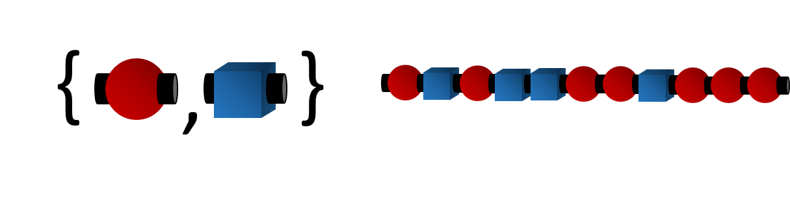

### Block Copolymer

> Example of block copolymer 
>
> 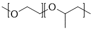

```plaintext
{[][<]OCC[>][<]}{[>][<]OC(C)C[>][]}
```

> Note that in this case, the "end group" for each of the polymeric segment is another polymer segment.

Block copolymers can be constructed by having more than one stochastic objects in sequence.


Since syntax-wise stochastic objects behave just like atoms, multiple blocks can be readily represented by concatenating multiple stochastic objects.

### Alternating Polymer

> Example of  alternating copolymer 
>
> 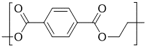

```plaintext
{[][<]C(=O)c1ccc(cc1)C(=O)[<],[>]OCCO[>][]}
```

Alternating polymer can be constructed by having two repeating units, with one unit containing only the `<` descriptor, and the other containing only the `>` descriptor.

 

### Branched Polymer

> Polyethylene with branching reads

```plaintext
{[][$]CC[$],[$]CC([$])[$][]}
```

Branched polymer can be obtained by including repeat units with more than two bonding descriptors.


### Polymer Graft

> Example of polymer graft
>
> 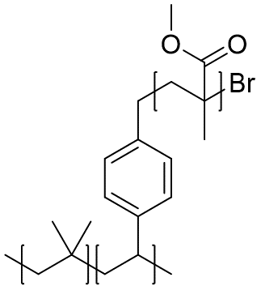

```plaintext
{[][$]CC(C)(C)[$],[$]CC(c1ccc(cc1)C{[$][$]CC(C)(C(=O)OC)[$][$]}Br)[$][]}
```

Polymer graft can be encoded by including repeat units that contain macromolecular pendant groups.

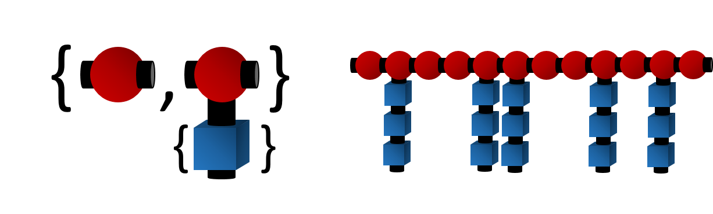

Since syntax-wise stochastic objects behave just like atoms, the graft can be represented as a stochastic object nested within the outer stochastic object.

### Macromonomer

> Example of polyurethane with oligomer chain extenders
>
> 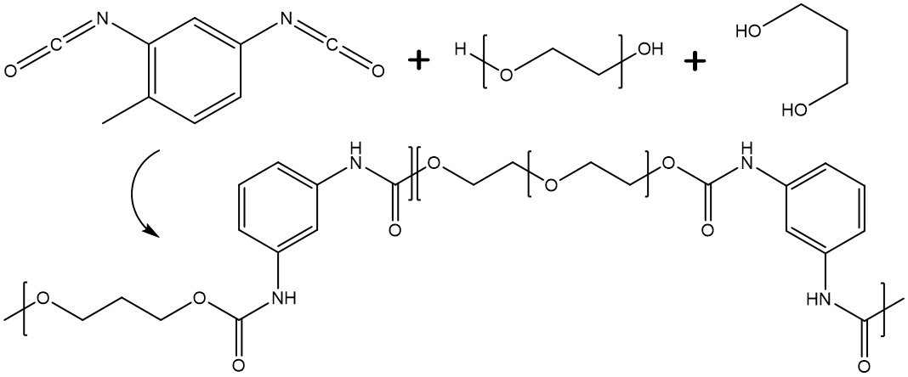

```plaintext
{[][>]C(=O)Nc1ccc(C)c(c1)NC(=O)[>],[<]OCC{[<][>]OCC[<][>]}O[<],[<]OCCCO[<][]}
```

Polymer synthesized from macromonomers can be easily represented by including repeat units that contains stochastic objects.

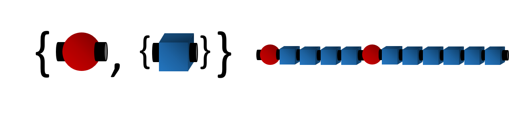

Since syntax-wise stochastic objects behave just like atoms, the macromonomer can be represented as a stochastic object nested within the outer stochastic object.

## Simplifications and Abbreviations

To increase the readability of BigSMILES strings, several simplification schemes are introduced on top of the BigSMILES syntax. It should be noted that these are considered simplified conventions, and should not be considered as part of the formal syntax of the BigSMILES line notation.

### Simplification for AA-Type Descriptors

> The simplification for AA-type descriptor is especially useful for vinyl polymers. For instance, the poly(ethylene-butene) example can be simplified into

```
{[][$]CC[$],[$]CC(CC)[$][]} (full)
{[]CC,CC(CC)[]} (simplified)
```

In the case when a stochastic object:

1. contains only AA-type bonding descriptors (no AB-type)
2. contains only one AA-type descriptor
3. the bond order associated with the descriptor is 1
4. every repeat unit has at least two bonding descriptors
5. the BigSMILES string for every repeat unit is written so that the string starts with a descriptor and ends with a descriptor

then the descriptors at the ends of the repeat units can be omitted. This convention can greatly simplify the expression for vinyl polymers.

### Simplification for AB-Type Descriptors

> The simplification for AB-type descriptor is especially useful for polymers such as poly(amino acid). For instance, a glycine alanine copolymer, the simplification reads
>
> 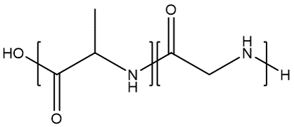

```plaintext
O{[>][<]C(=O)C(C)N[>],[<]C(=O)CN[>][<]} (full)
O{[>]C(=O)C(C)N,C(=O)CN[<]} (simplified)
```

> However, it should be noted that if the original polymer is written as

```plaintext
{[<][<]C(=O)C(C)N[>],[<]C(=O)CN[>][>]}O (cannot be simplified)
```

> then this BigSMILES string cannot be simplified because condition 7 is not satisifeed. To express the polymer under this end group configuration, the repeat units must be "flipped":

```plaintext
{[<][>]NC(C)C(=O)[<],[>]NCC(=O)[<][>]}O (full)
{[<]NC(C)C(=O),NCC(=O)[>]}O (full)
```

In the case when a stochastic object:

1. contains only AB-type bonding descriptors
2. contains only one AB-type descriptor
3. the bond order associated with the descriptor is 1
4. every repeat unit has exactly one descriptor of `<` type and one of `>` type
5. the BigSMILES string for every repeat unit is written so that the string starts with a descriptor and ends with a descriptor
6. every repeat unit starts with the same descriptor (all starts with `>` or all starts with `<`) and ends with the other descriptor
7. at least one terminal bonding descriptor is specified, and the terminal descriptors correspond to the configuration in which the repeat units can be directly concatenated with the explicit end groups in the given orientation (without flipping).

then the descriptors at the ends of the repeat units can be omitted. This convention can greatly simplify the expression for polymers such as poly(amino acids). 

### Fragment Name Definition Notation

> The fragment name definition can be useful for polymers with complex pendant groups. For example, the readability of the BigSMILES encoding could be greatly increased for the following polymer by replacing the complex side group
>
> 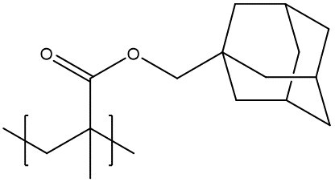

```plaintext
{[][$]CC(C)([#R])[$][]}.{#R=C(=O)OCC12CC(C3)CC(C1)CC3C2}
```

> The fragment name definition is also useful when there are repetitive structures within the polymer
>
> 

```plaintext
C([#Arm])([#Arm])([#Arm])[#Arm].{#Arm=CO{[<][>]CCO[<][>]}}
```

In some cases, it might be more beneficial to have some portions of the BigSMILES representations be replaced by more abstract but compact proxies, for example, the names of repeating units. This is especially helpful when the structure is complex, and the resulting BigSMILES representation becomes long. 

To facilitate understanding, a definition of molecular fragments that associate user-defined names with partial BigSMILES strings is allowed in BigSMILES. Within a BigSMILES string, a segment of the string can be replaced by a placeholder object with the following syntax:

`'[' + '#' + fragment_name + ']'`

The `fragment_name` should consist of only printable ASCII symbols (excluding whitespace characters). 

In principle, as long as stochastic objects entirely contained, any segment can be replaced by such placeholder. However, it is recommended that bonding descriptors (except for those bracketed within a stochastic object) not be replaced and be left explicit within a BigSMILES string to avoid misleading expressions.

In general, the definition for each placeholder fragment name used within a BigSMILES string must be given at the end of the BigSMILES string. The syntax for such definition is:

`'.' + '{' + '#' + fragment_name + '=' + BigSMILES_string + '}'`

each fragment definition is enclosed within a pair of curly brackets, and each definition is separated by dots (`.`). Combining the placeholder and definition sections, the full syntax for the fragment name definition notation reads:

`BigSMILES_string + '[' + '#' + fragment_name + ']' + BigSMILES_string + '.' + '{' + '#' + fragment_name + '=' + BigSMILES_string + '}'`

The only exception for the need of such explicit definition is when the placeholder is one of the common repeat units that has been defined in this [repository](https://olsenlabmit.github.io/BigSMILES/docs/Common_Repeat_Unit_List.md). These fragment names can be used without further re-definition.

## Ladder Polymers

> To illustrate the usage of the multiatom bonding descriptor, consider the following example:
>
> 
>
> The polymer is a ladder polymer with two parallel AB type bonds between each repeating unit. 
>
> First, since the two B moieties always connect to the same repeat unit, the bonding descriptor for them share the same group id. Similarly, the bonding descriptors on the A moieties share the same group id. (Choose `group_id`=1 for A and 2 for B).
>
> Since the overall connectivity between the two groups are of the AB type, the outer descriptor type is denoted by the `<` and `>` symbols. Hence, the outer bonding descriptors have the form:

```plaintext
A([<1[Inner]1])R(A[<1[Inner]1])(B[>1[Inner]2])B[>1[Inner]2]
```

> For the inner layer, since individual atoms are also of AB-type, the inner bonding descriptor are also denoted by the  `<` and `>` descriptors. Therefore, the complete ladder bonding descriptor reads

```plaintext
A([<1[<1]1])R(A[<1[<1]1])(B[>1[>1]2])B[>1[>1]2]
```

> To provide more illustrations on how the inner layer should be written, consider another example:
>
> 
>
> In this case, instead of having AB type bonds, the ladder polymer have a overall AA type connectivity in which the repeating units can be flipped arbitrarily. Owning to this nature, the outer descriptor type for this polymer is `$`, and the outer descriptors read

```plaintext
A([$1[Inner]1])R(A'[$1[Inner]1])(A[$1[Inner]2])A'[$1[Inner]2]
```

> Now, the inner layer descriptor depends on the exact connectivity pattern between the repeating units. Consider the three different cases:
>
> 1. Connections between A-A, A-A’, and A’-A’ are all allowed
> 2. Connections between A-A and A’-A’ are allowed, but A-A’ is not allowed
> 3. Only connection between A-A’ is allowed, connections between A-A, A’-A’ not allowed
>
> For the first case, the connectivity can be described by a single AA type connection among the group of A and A', leading to the overall bonding descriptor

```plaintext
A([$1[$1]1])R(A'[$1[$1]1])(A[$1[$1]2])A'[$1[$1]2]
```

> For the second case, As and A's can still form AA type connections within themselves, but cross-connections are disallowed. Therefore, the inner layer must be described by two orthogonal AA type connections, leading to the BigSMILES

```plaintext
A([$1[$1]1])R(A'[$1[$2]1])(A[$1[$1]2])A'[$1[$2]2]
```

>  For the last case, A and A' form conjugate AB type bonds; therefore, the inner layer reads

```plaintext
A([$1[<1]1])R(A'[$1[>1]1])(A[$1[<1]2])A'[$1[>1]2]
```

The BigSMILES syntax up to this point assumes that neighboring repeating units are always connected through a single pair of atoms. However, for some materials, such as ladder polymers, this condition does not hold. To represent ladder polymers or other polymers with multiple connections between a single pair of repeating units, the bonding descriptors are nested by the following syntax:

`ladder_bond_descriptor = '[' + outer_descriptor + '[' + inner_descriptor + ']' + group_id + ']'`

The bonding descriptor for multiatom connections is composed of four components:

1. the outmost square brackets,
2. the `group_id` of multi-atom bonds, an integer label for specifying the grouping of bonding descriptors within a repeat unit
3. `outer_descriptor`, the outer bonding descriptor with syntax 
   * `outer_descriptor = outer_descriptor_type + outer_descriptor_id `
4. `inner_descriptor`, the inner bonding descriptor with syntax
   * `inner_descriptor = inner_descriptor_type + inner_descriptor_id `

### Grouping of Bonding Descriptors and the Outer Bonding Descriptor

To describe multi-atom bonds, the atoms with bonding descriptors within the same repeat unit must first be divided into groups. Each group corresponds to the collection of atoms that always connect to the same neighboring repeating unit. The grouping is specified by the `group_id` parameter. Note that since `group_id` is used to group atoms/descriptors within the same repeat unit, the labels can be reused for groups on distinct repeating units. 

Once the grouping is established, dimers and higher order fragments could be constructed by joining multiple repeat units. To describe the connectivity patterns that are permissible, the *outer* bonding descriptor is used. This outer bonding descriptor is analogous to the bonding descriptor found in normal non-ladder connections. The only difference between the ladder and non-ladder bonding descriptors is that the non-ladder descriptors describe the connectivity pattern of a single bond between two repeat units, whereas the ladder version describes the connectivity pattern of a group of bonds between two repeat units. It should be emphasized that since the entire group are collectively described by the same outer descriptor, individual bonding descriptors within the same group should always share the same outer descriptor type and the same outer descriptor id. 

### Inner Bonding Descriptor

While the outer bonding descriptor specified how group of bonds are established between repeat units, how each individual atom within the two groups are actually connected to form a proper ladder bond have yet to be specified. This information is encoded within a second bonding descriptor: the inner bonding descriptor. Similar to the outer descriptor, the inner bonding descriptor is also given by the same syntax as the usual bonding descriptor.

<aside class="warning">
The terminal bonding descriptor syntax has been updated and is different from the <a href="https://pubs.acs.org/doi/10.1021/acscentsci.9b00476">version 1.0 presented in ACS Central Science</a>.
</aside>

# Special Topics

## Tacticity

> To demonstrate how this notation can be used to specify tacticity, consider a polypropylene (PP) with pure head-to-tail configuration as example. 
>
> Atactic PP reads

```plaintext
CC{[>][<]CC(C)[>][<]}CC(C)=C
```

> Meanwhile, isotactic PP synthesized with Ziegler-Natta catalyst TiCl<sub>3</sub> and Al(C<sub>2</sub>H<sub>5</sub>)<sub>2</sub>Cl and terminated through β-hydrogen elimination or β-hydrogen transfer to monomer is represented by 

```plaintext
C{[>][<]C[C@@H](C)[>][<]}CC(C)=C
```

> whereas syndiotactic PP synthesized with VCl<sub>4</sub> and Al(C<sub>2</sub>H<sub>5</sub>)<sub>2</sub>Cl as catalyst reads

```plaintext
CC{[>][<]C[C@@H](C)C[C@H](C)[>];[<]C=CC,[<]C[C@H](C)C=CC[]}
```

> In the last example, the polymer is assumed to terminate through α-hydrogen elimination or α-hydrogen transfer to monomer, which leads to two possible end groups. The first possibility being that the polymer has an overall even number of carbon atoms along the backbone, whereas the second corresponds to the polymer having odd number of carbon atoms.

Stereochemistry and chirality is supported by the `@` and `@@` modifiers provided by SMILES. 

In general, the tacticity of a polymer include the following cases:

1. Atactic:  
   The polymer is assumed to be atactic if no explicit chirality specification is provided. 
2. Isotactic:  
   To specify an isotactic polymeric segment, the repeat unit should be modified with either the `@` or `@@` symbols to enforce the stereochemistry. For instance, the repeat unit of the following polymer reads  
     
   `[<]C[C@@H](C)[>]`  
   whereas its stereoisomer reads  
     
   `[<]C[C@H](C)[>]`   
3. Syndiotactic:  
   To specify an syndiotactic polymer, the correlation between adjacent repeat units must be specified. This could be achieved by using the dimer of repeat units, or dyads, as the basic repeat unit instead:  
     
   `[<]C[C@@H](C)C[C@H](C)[>]`

Note that here the `<` ,`>` bonding descriptors are used instead of `$` to restrict flipping of the orientation of the repeating units; this effectively specifies a purely head-to-tail configuration. 

## Geometric Isomers

SMILES denote the geometric isomers adjacent to double bonds with the `\` and `/` bonding symbols. In BigSMILES, these notations are used to describe the exact structure for isomers.

Consider poly(ethyne), the polymer can be in one of the three states:

1. Unspecified isomeric state:  
   If the isomeric state is not explicitly known, the normal single bonds are used to indicate that the isomeric state is unspecified  
   `[$]-C=C-[$]`
2. Trans isomer:  
   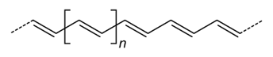  
   The trans isomer can be denoted by the following repeat unit  
   `     [$1]/C=C/[$1]  ` or `     [$1]\C=C\[$1]  `
3. Cis isomer:  
   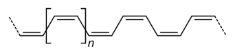  
   The cis isomer can be denoted by the following repeat unit  
   `     [$1]\C=C/[$1]  ` or `     [$1]/C=C\[$1]  `

As illustrated in the following figure, since in BigSMILES the process of concatenating two atoms with matching bonding descriptors is equivalent to forming a connection between the corresponding molecular graphs, therefore, even for bonding descriptors with leading bonds that are not identical, for instance,

`...C=C/[$]` and `[$]\C=C...`  

or 

`...C=C/[$]` and `[$]-C-C...`

the bonding descriptors are still considered consistent.


In general, as long as the bond order for the bonds leading to the bonding descriptors matches, they are considered consistent.

## Polyelectrolytes

> Another example of a charged polymer is the quaternized 4-vinylpyridine polymer
>
> 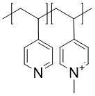
>
> synthesized by Obermeyer et al. (*Soft Matter*,*12*(15), 3570-3581, **2016**). 
>
> The BigSMILES for the polymer reads

```plaintext
{[][$]CC(c1ccncc1)[$],[$]CC(c1cc[n+](C)cc1)[$].[I-][]}
```

In SMILES, there is no explicit notation for ionic bonds, and ionic species are expressed as separate compounds and joined together into a SMILES string with the dot `.` symbol. For example, sodium chloride reads

`[Na+].[Cl-]`

To denote polyelectrolytes, the repeat units are written in a similar fashion. For instance, the repeat unit for poly(methacrylic acid, sodium salt) reads

`[$]CC(C)(C(=O)[O-])[$].[Na+]`

and the polymer reads

`{[][$]CC(C)(C(=O)[O-])[$].[Na+][]}`

By explicitly including both the charged repeat unit and its counter-ion within the BigSMILES repeat unit, the overall neutrality of the whole polymer is guaranteed.

Similarly, for other strong polyelectrolytes, such as poly(sodium styrene sulfonate), the BigSMILES repeat unit is written in a similar way

`{[][$]CC(c1ccc(S(=O)(=O)[O-])cc1)[$].[Na+])[]}`

For weak polyelectrolytes, the partial dissociation can be represented by including both the dissociated and undissociated repeating units within the list; for example, poly(acrylic acid) can be represented as

`{[][$]CC(C(=O)O)[$],[$]CC(C(=O)[O-])[$].[OH3+][]}`

By explicitly including the different repeating unit-counter-ion pairs, this representation can also be used to denote polyelectrolytes with multiple counter-ions. 

## Branched Polymers and Polymer Networks

> In general, a branched polymer synthesized with A and B type precursors will read
>
> 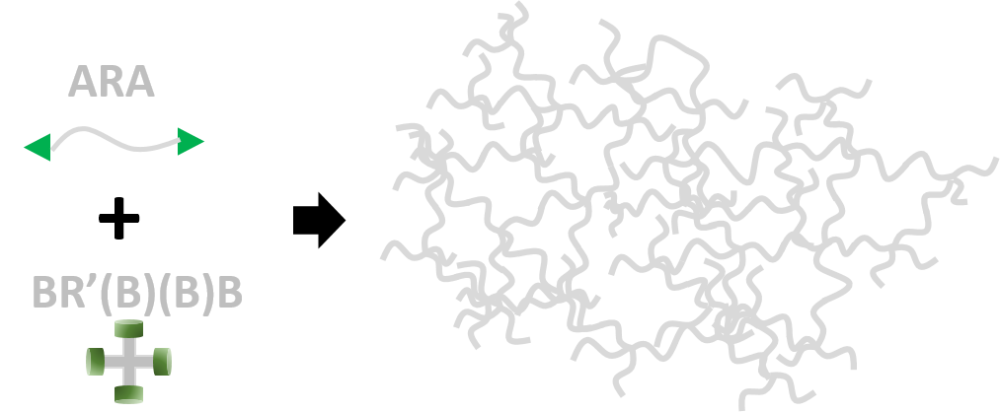

```plaintext
{[][<][#A][#R][#A][<],[>][#B][#R']([#B][>])([#B][>])[#B][>][]}
```

> where `#A`, `#B`, `#R` and `#R'` are placeholders for reactive and linking chemical fragments.
>
> Examples of this type of polymer include end-linked elastomers, gels and epoxide networks.
>
> As discussed in detail in the end group section, for these randomly branched networks, it is necessary to include implicit end groups to fully cap the entire polymer. 

```plaintext
{[][<][#A][#R][#A][<],[>][#B][#R']([#B][>])([#B][>])[#B][>];[>][#E1],[<][#E2][]}
```

> where `#E1` and `#E2` are placeholders for end groups attached to `#A` and `#B` ends.

By having repeating units with more than two bonds to other units, the syntax of BigSMILES naturally extends from linear polymers to branched polymers and polymer networks. For example, a branched poly(ethylene) can be encoded as

`{[][$]CC[$],[$]CC([$])[$],[$]C([$])C([$])[$][]}`

where the first repeat unit represent the linear unit, and the latter two are repeat units with functionality of three and four.

Similar syntax can also be used to represent other branching structures, such as hyperbranched polymers,  dendrimers or even polymer networks and gels. For instance, a polyethylenimine hyperbranched polymer reads

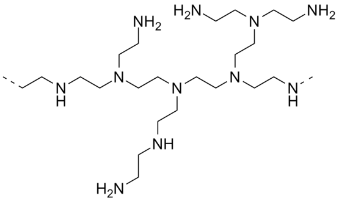

`{[][<]CCN([>])[>][]}`

Moreover, polymer networks can also be encoded by with similar strategy. For example, poly(1,3-butadiene) rubber vulcanized by sulfur bridges reads

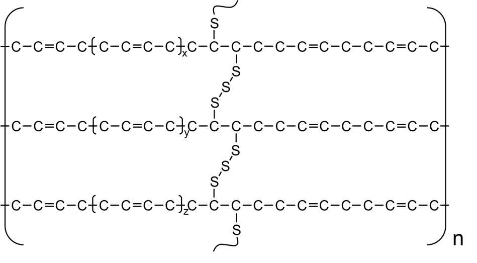

`{[][$]CC=CC[$],[$]CC([<])C([<])C[$],[>]{[$][$]S[$][$]}[>][]}`

## Dynamic, Topological and Physical Bonds

The same syntax can also be used to represent several other types of polymer networks or structures beyond the scope of traditional chemical networks, including vitrimers, double network gels (DN gels), poly(metal organic cage) (polyMOC) and poly(metal organic framework) (polyMOF) networks. 

### Vitrimers

For vitrimers, since all bonds between the components are covalent, and local connectivity rules are well-defined, they can be simply encoded with the same syntax as usual chemical networks shown in the previous sections. 

However, it should be noted that the dynamic natures of the bonds cannot be captured by the static representation.

### Double Network (DN) Gels

For DN gels, the coexisting molecules that are not covalently bonded can be represented by a set of repeating units with orthogonal bonding types. For example, denoting the repeating unit of the first network by A and the second by B, a simple (yet unrealistic) DN gel can be encoded as

`{[][$1]A([$1])[$1],[$2]B([$2])[$2][]}`

Meanwhile, it is worth noting that the topological bonds are beyond the current design of BigSMILES language, and cannot be faithfully reflected.

### PolyMOCs and PolyMOF

> As an example, consider the M<sub>2</sub>L<sub>4</sub> polyMOC synthesized by Zhukhovitskiy et al. 
>
> 
>
> can be represented by the BigSMILES

```plaintext
{[][>]COC(=O){[$][$]COC[$][$]}C(=O)OC[>],
c1([<])cc([#L]2)cc([#L]3)c1.c4([<])cc([#L]5)cc([#L]6)c4.
c7([<])cc([#L]8)cc([#L]9)c7.C%10([<])cc([#L]%11)cc([#L]%12)c%10.
[Pd++]258%11.[Pd++]369%12}.{#L=c(c1)cccn1}
```

If the single bond notation is extended to incorporate also the coordinate bonds, metal organic networks could also be encoded using the BigSMILES. 

However, while BigSMILES could capture the local connectivity pattern for MOFs, the local nature of BigSMILES means that large scale ordering, such as the crystalline structure of MOFs, could not be captured. Furthermore, the SMILES `@` and `@@` syntax for chirality is insufficient to fully specify the three-dimensional structure of a metal center that has more than four ligands.

### Other Networks

Besides the discussed networks, there are still many other types of polymer networks, including physical networks or topological network such as the slide-ring gel. Currently, BigSMILES do not support most of these non-covalent networks. However, as SMILES is further developed, support for these more complex structures may be possible in future revisions of BigSMILES.

## Macrocycles

> Consider a polystyrene ring synthesized through alkyne azide click chemistry, since rings and cycles within repeating units do not extend beyond a single repeating unit, the macrocycle associated with the ring polymer can be treated with the usual SMILES ring closure syntax:
>
> 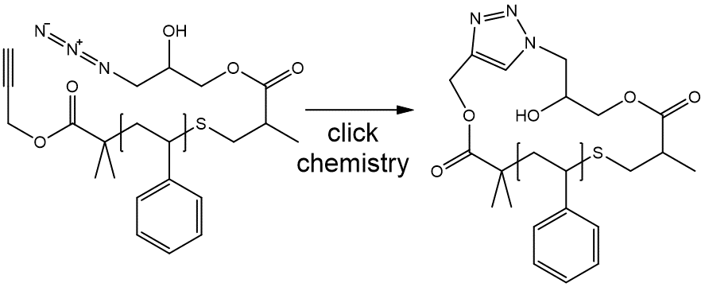

```plaintext
S1C(c2ccccc2){[$][$]CC(c1ccccc1)[$][$]}C(=O)OC(=C3)N=NN3CC(O)COC(=O)C(C)C1
```

> Note that the integer identifier that was used within the repeating units for ring closure is considered to be independent of any ring closure ID that was used in other parts of the BigSMILES string.

### Well-defined Macrocycles

For well-defined macrocycles, such as the cycle structures in ring polymers, the macrocycles are encoded using the usual syntax for describing cycles in SMILES. This is illustrated by the first example in the right panel.

### Implicit Ring Polymers

> Consider a ring polymer synthesized with ring expansion metathesis polymerization (REMP)
>
> 
>
> To denote a ring polymer, the ring notation must be explicitly invoked

```plaintext
C1CCC{[$1][$1]=CCCCCCCC=[$1][$1]}CCCC1
```

> However, the uncapped linear polymer 

```plaintext
{[][$1]=CCCCCCCC=[$1][]}
```

> also implicitly include similar ring polymers.

It should be emphasized that for a linear polymer of the form 

`{[][$][#RepUnit][$][]}`

although there is no explicit reference to any cycle, since a ring polymer is also a valid outcome of the connectivity pattern, the molecular ensemble would implicitly include both the uncapped linear fragments and also ring polymers without any open ends. This is meant to reflect the potential ring-chain formation competition that naturally occurs during polymerization. 

### Random Cycles

For stochastic objects representing branching polymers, products with random cyclization are also included within the ensemble of possible structures. This looping structure is currently not explicitly presented within the BigSMILES representation, because each cycle requires indexing in the SMILES language, and it is impossible to fully track such random cyclization explicitly. Rather, the possibility of this type of random macrocycle formation is implicitly included through expressing the rules of connectivity that allow for the enumeration of these macrocycles.


# Version History

## version-1.1

### Date

November 11, 2019

### Major Updates

Made changes to the bonding descriptor syntax:

1. Changed bonding descriptor from `descriptor_type + bond_type + descriptor_id` to `'[' + descriptor_type +  descriptor_id  +  ']'` and moves bonding symbol out of the descriptors
   * Made descriptors completely identical to atoms in terms of syntax
   * Resolve incompatibility with SMILES quadruple bonds `$`
   * Resolve potential conflict with reaction SMILES `>`
2. Changed ladder bonding descriptor syntax: added `group_id` 
   
* Original syntax may lead to ambiguous semantics
   
3. Changed terminal bonding descriptor syntax

   * To eliminate ambiguity, the terminal bonding descriptors are always required, even if it is empty 

     

## version-1.0

### Date

September 12, 2019

### Major Update

BigSMILES line notation published on [ACS Central Science](https://pubs.acs.org/doi/10.1021/acscentsci.9b00476)